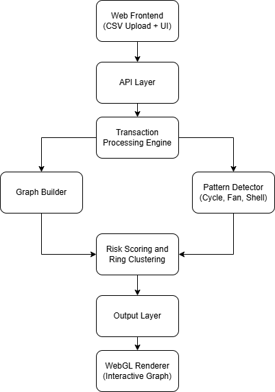

# Financial Forensics Engine

**Live Demo URL:**
[https://easypeasy-orcin.vercel.app](https://easypeasy-orcin.vercel.app)

---

## 1. Overview

**easypeasy Money Muling Detection System** is a graph-based financial intelligence web application designed to detect, score, and visualize suspicious money movement patterns such as mule cycles, smurfing, and layered shell networks. The system runs entirely in the browser using Next.js and WebGL, constructing a transaction graph, executing detection algorithms client-side, and rendering an interactive visualization for analysts.

The core design goals are:

* High-precision detection of laundering-like structures
* Explainable, evidence-based scoring rather than opaque black-box classification
* Efficient in-browser graph analysis with strong pruning and domain constraints
* Analyst-friendly, interactive visualization and inspection tools

---

## 2. Tech Stack

* **Framework:** Next.js
* **Language:** TypeScript
* **Styling:** Tailwind CSS
* **Visualization:** WebGL (Sigma + Graphology)
* **Deployment:** Vercel
* **Algorithms & Data Structures:** Graphology, custom client-side graph analysis modules

---

## 3. System Architecture



The system is organized as a **modular, pipeline-style architecture** where each stage transforms the data and passes it to the next stage for analysis and visualization.

### 3.1 Pipeline Overview

1. **Web Frontend (CSV Upload + UI)**

   * The user uploads transaction data (e.g., CSV files) and interacts with the application through the web interface.
   * Provides controls for loading data, exploring results, and inspecting suspicious accounts and patterns.

2. **API Layer**

   * Acts as the coordination layer between the UI and the internal processing modules.
   * Validates inputs, manages data flow between components, and triggers analysis pipelines.
   * In the current implementation, this layer is implemented within the Next.js application (client-side), not as a separate backend service.

3. **Transaction Processing Engine**

   * Parses and normalizes raw transaction data into a structured internal representation.
   * Performs preprocessing such as:

     * Timestamp normalization
     * Amount parsing
     * Basic sanity checks and filtering
   * Produces a clean, analysis-ready transaction dataset.

4. **Graph Builder**

   * Constructs a directed, temporal transaction graph from the processed transactions.
   * Nodes represent accounts.
   * Edges represent transactions, ordered by time.
   * Computes auxiliary statistics such as degrees and per-node transaction counts.

5. **Pattern Detector (Cycle, Fan, Shell)**

   * Runs specialized detection algorithms on the graph, including:

     * **Cycle detection** for mule-layering loops (length 3–5)
     * **Smurfing detection** for fan-in / fan-out burst patterns
     * **Layered shell detection** for multi-hop relay chains of low-activity accounts
   * Outputs detected structures and per-account pattern signals.

6. **Risk Scoring and Ring Clustering**

   * Aggregates signals from all detectors and structural/temporal features.
   * Computes a **suspicion score** per account using an evidence accumulation (log-odds) model.
   * Groups related suspicious accounts into **rings / clusters** based on shared patterns and graph connectivity.

7. **Output Layer**

   * Prepares analysis results for presentation, including:

     * Node-level scores and labels
     * Detected patterns and clusters
     * Metadata required by the visualization layer
   * Acts as the final data interface between analysis and rendering.

8. **WebGL Renderer (Interactive Graph)**

   * Renders the transaction graph and analysis results using WebGL.
   * Visual encodings include:

     * Node color by risk level
     * Node size by suspiciousness
     * Interactive hover and inspection tooltips
   * Enables analysts to explore clusters, cycles, and shell structures visually.

### 3.2 Key Architectural Properties

* Fully **pipeline-driven**: each stage has a clear responsibility.
* **Modular**: detection, scoring, and visualization are cleanly separated.
* **Client-side execution**: all stages run inside the Next.js application without a dedicated backend.
* **Explainable by design**: every visual element is backed by explicit graph features and detected patterns.

---

## 4. Algorithmic Approach

### 4.1 Mule Cycle Detection (Temporally-Constrained Cycles)

The primary detection engine identifies **directed money-flow cycles of length 3–5** that match realistic laundering and mule-layering patterns. The algorithm enforces:

* Strict temporal forward flow
* Per-hop amount constraints
* Cumulative decay bounds
* Velocity bound
* Merchant / hub exclusion
* Parallel-edge optimization
* Canonicalization
* Subsumption suppression

**Pipeline stages:**

* Stage 0: Graph construction and eligibility filtering
* Stage 1: Fast-path detection of 3-cycles (triangles)
* Stage 2: Bounded DFS for 4–5 length cycles with heavy pruning
* Stage 3: Merge, canonicalize, and suppress subsumed cycles
* Stage 4: Sort results by cumulative decay (most suspicious first)

**Complexity:**

```text
Let:
V = number of nodes
E = number of edges
d̄ = average degree after filtering

Graph construction: O(E)
Triangle detection: O(E * d̄)   (with strong pruning)
Bounded DFS (length 4–5): Near-linear in practice due to:
  - Degree caps
  - Temporal pruning
  - Amount feasibility pruning
  - Lookahead closure checks

Memory: O(V + E) + small caches for parallel-edge resolution
```

---

### 4.2 Smurfing Detection (Fan-In / Fan-Out Bursts)

**Approach:**

```text
For each account:
  Maintain inbound and outbound time series
  Use a sliding 72-hour window
  Track max unique counterparties in any window

If max_unique_inbound > threshold:
  Flag as fan-in

If max_unique_outbound > threshold:
  Flag as fan-out
```

**Complexity:**

```text
Per account: O(T_a) where T_a = number of transactions for that account
Total over all accounts: O(E)
Memory: O(U) per window, where U = unique counterparties in window
```

---

### 4.3 Layered Shell Network Detection

**Approach:**

```text
Define shell account:
  total_transactions <= 3

For each start node:
  Run bounded BFS up to depth MAX_DEPTH
  Track simple paths (no revisits)

When a path reaches MAX_DEPTH:
  Inspect intermediate nodes (exclude start and end)
  If count(intermediates) >= 2 AND all are shell accounts:
    Mark path as layered shell network
    Add all nodes in path to shell set
```

**Complexity:**

```text
Worst case: O(V * d^MAX_DEPTH)
In practice: much lower due to:
  - Small MAX_DEPTH
  - Shell filtering
  - Early pruning of revisits

Memory: bounded by BFS queue and path storage
```

---

## 5. Suspicion Score Methodology

### 5.1 Objective

Assign each account a deterministic fraud risk score in the range 0–100 such that:

* Scores are comparable across accounts
* Scores remain bounded
* Legitimate vendors are dampened
* Scoring is deterministic and reproducible

---

### 5.2 Core Design Principle

```text
X_norm = (X - X_min) / (X_max - X_min + epsilon)
```

---

### 5.3 Raw Feature Construction

#### 5.3.1 Circular Fund Routing (Cycle Strength)

```text
If L in [3, 5]:
  cycle_raw = 6 - L
Else:
  cycle_raw = 0
```

#### 5.3.2 Fan-In / Fan-Out Strength

```text
fan_raw = max(fan_in_count, fan_out_count)
fan_raw = fan_raw * (1 - vendor_continuity_ratio)
```

#### 5.3.3 Layered Shell Depth

```text
If D >= 3:
  shell_raw = D - 2
Else:
  shell_raw = 0
```

#### 5.3.4 Burst Activity Strength

```text
If avg_window_tx == 0:
  burst_raw = 0
Else:
  burst_ratio = max_window_tx / avg_window_tx
  burst_raw = burst_ratio
```

---

### 5.4 Vendor Continuity Ratio

```text
lifespan_days = max_timestamp - min_timestamp

If lifespan_days < 14:
  vendor_continuity_ratio = 0
Else:
  Split lifespan into equal windows (e.g., 7 days)
  Compute tx_counts per window
  CV = std(tx_counts) / mean(tx_counts)
  continuity_base = 1 - min(1, CV)
  lifespan_factor = min(1, lifespan_days / 180)
  vendor_continuity_ratio = continuity_base * lifespan_factor
```

---

### 5.5 Feature Normalization

```text
For each feature X:
  If X_max == X_min:
    X_norm = 0
  Else:
    X_norm = (X - X_min) / (X_max - X_min + epsilon)
```

---

### 5.6 Weighted Risk Aggregation

```text
risk_score_0_1 =
  0.35 * C_n +
  0.30 * F_n +
  0.20 * S_n +
  0.15 * B_n

Score = 100 * risk_score_0_1
Clamp Score to [0, 100]
```

---

### 5.7 Additional Vendor Dampening

```text
If vendor_continuity_ratio > 0.6 AND lifespan_days > 90:
  Score = Score * 0.7
Clamp Score to [0, 100]
```

---

### 5.8 Risk Classification

| Score Range | Risk Level |
| ----------- | ---------- |
| ≥ 80        | Severe     |
| 60–79       | High       |
| 40–59       | Moderate   |
| < 40        | Low        |

---

### 5.9 Edge Case Handling

```text
If all raw features are zero:
  Score = 0

If mean window count == 0:
  continuity_ratio = 0

If number of windows < 3:
  continuity_ratio = 0

All divisions use epsilon to avoid division by zero
```

---

## 6. Installation & Setup

### 6.1 Prerequisites

* Node.js
* npm

### 6.2 Setup Commands

```bash
git clone <repository-url>
cd easypeasy
npm i
npm i next
npm run dev
```

Open in browser:

```text
http://localhost:3000
```

---

## 7. Usage Instructions

1. Open the live demo or run the app locally.
2. Load or select a dataset of transactions.
3. The application builds the transaction graph in memory.
4. Detection algorithms and scoring run client-side.
5. The UI renders:

   * The transaction graph
   * Node colors by risk level
   * Node sizes by suspiciousness
6. Hover over nodes to inspect:

   * Account ID
   * Suspicion score
   * Risk category
   * Detected patterns
7. Use zoom and pan to explore clusters, cycles, and shell structures.

---

## 8. Known Limitations

* All computation runs client-side and is limited by browser memory and CPU.
* Detection is pattern-based, not a full probabilistic model of financial crime.
* Adaptive adversaries can attempt to evade fixed structural heuristics.
* Dataset-relative normalization means scores can shift as the population changes.
* Very large graphs may cause performance issues in the browser.
* The system does not currently incorporate:

  * KYC data
  * Device/IP/geo intelligence
  * Cross-platform identity resolution

---

## 9. Team Members

1. Sahil Adit
2. Shivraj Patil
3. Varad Hajare
4. Ojas Deshpande
